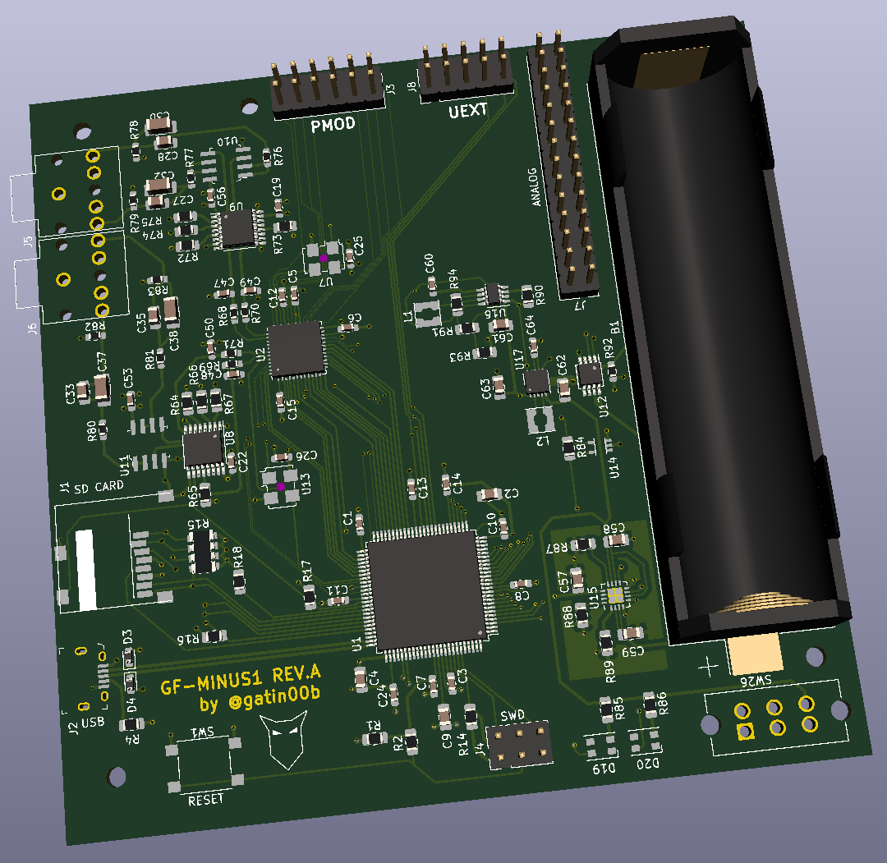

# Gluten-Free Project

## What is the Gluten-Free Project?

Gluten-Free Project is an open-source platform aimed at makers and musicians for real-time audio synthesis in a live setup.

It is meant to be portable, battery powered, small form factor self-contained and highly reconfigurable synthesizer.

GF-MINUS1 is the first iteration of the core of Gluten-Free. It features a low-power FPGA as its fully customizable soundchip and a SAME53 for high-speed communication. The soundchip provides two independant stereo outputs as well as a PMOD expansion interface. It is a bare-bone version designed to interface with expansion boards.

## Why Gluten-Free?

Gluten-Free was initiated to push the boundaries of what was available to makers with a music inclination.

It is also a platform meant to learn about digital design on a platform including an FPGA connected through an high-speed interface to a microcontroller.

## What can I do with Gluten-Free?

### GF-MINUS1

GF-MINUS1 is still in active development. As development progresses, the list of its capabilities is going to be expanded.

## Where is Gluten-Free Project going?

Gluten-Free is looking to expend the DIY synthesizer community and its userbase. The goal is to provide a powerful platform able to provide the computing power required for modern synthesizers for makers to focus on their desired implementation.

## How to get involved?

We are most on our [Discord channel](https://discord.gg/bngMxeF9Fw), so feel free to join and ask questions, offer suggestions, etc. The development is mostly done live on [gatin00b's Twitch channel](www.twitch.tv/gatin00b) is also a great place for discussion.

## Who's working on Gluten-Free?

* [@gatin00b](www.twitter.com/gatin00b) started the initial design. 
* [@overtinkerer]() provided help with documentation and support of the Gluten-Free platform.
* [@vmttmv]() provided guidance on microcontroller selection.
* [@BlindVia](https://www.twitch.tv/BlindVia) provided guidance for manufacturing and a full review of Gluten-Free
